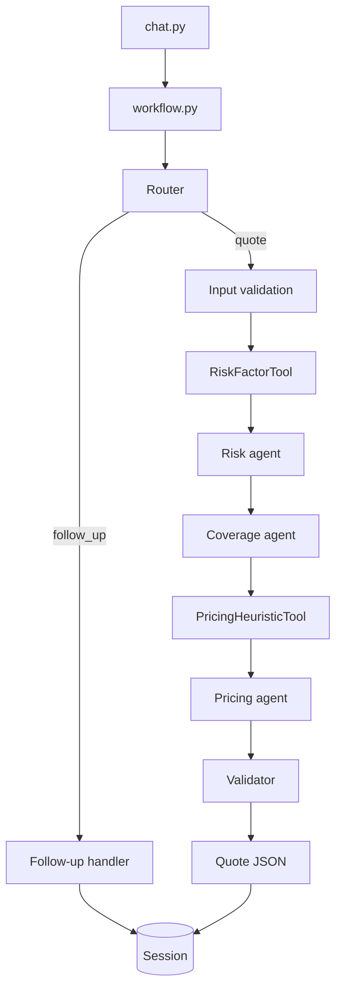

# Home Insurance Quote Advisor

Multi-agent pipeline that turns a customer profile (JSON) into a structured home insurance quote: risk factors, recommended coverages, premium range, and a short explanation. Follow-up questions reuse the same session so answers can reference the quote and the steps that produced it.

Built with Anthropic Claude, LangGraph for orchestration, and two rule-based tools for scoring and pricing anchors.

## Setup

```bash
cd insurance-quote-advisor
python -m venv .venv
.venv\Scripts\activate          # Windows
pip install -r requirements.txt
copy .env.example .env          # set ANTHROPIC_API_KEY
python tests/test_tools.py      # tools + validation only, no API call
python chat.py --profile data/profile_a.json --interactive
```

Follow-up in one command:

```bash
python chat.py -p data/profile_a.json -f "Why is this quote expensive?"
```

Sample profiles are in `data/`. `profile_b.json` has a null `credit_score` for testing incomplete input.

## Architecture



Agents do not call each other. `workflow.py` defines a LangGraph `StateGraph` that runs nodes in order and passes `QuoteGraphState` between them. Routing (new quote vs follow-up vs reject) happens in the graph, not inside individual agents.

## Layout

| Path | Role |
|------|------|
| `agents/` | One module per agent |
| `prompts/` | System prompts (one file each) |
| `schemas/` | Pydantic models for profiles, agent outputs, graph state |
| `tools/` | Rule-based `RiskFactorTool`, `PricingHeuristicTool` |
| `guardrails/` | Profile validation, output schema checks, consistency rules |
| `memory/` | In-process session for follow-ups |
| `workflow.py` | LangGraph graph + `QuoteWorkflow` entry point |
| `chat.py` | CLI |
| `provider.py` | Anthropic client |

## Agents

| Agent | Job | Main inputs | Output |
|-------|-----|-------------|--------|
| Router | Quote vs follow-up vs reject | User text + session flags | `RouterDecision` |
| Risk | Risk factors from profile + tool scores | Profile, `RiskFactorTool` result | `RiskAssessmentOutput` |
| Coverage | Coverages and limits from risk | Profile, risk output | `CoverageRecommendationOutput` |
| Pricing | Premium band | Profile, risk, coverage, heuristic tool | `PricingOutput` |
| Validator | Cross-check risk / coverage / price | Prior three outputs | `ValidatorOutput` |
| Follow-up | Answer about an existing quote | Question + session snapshot | `FollowUpResponse` |

Each agent loads its prompt from `prompts/` and returns JSON validated against `schemas/`.

## Tools

**RiskFactorTool** — Scores location, pool, claims, credit (650 if missing), home value, and age. Returns per-dimension scores and a composite 0–1 score. Pure Python.

**PricingHeuristicTool** — Starts from ~0.35% of home value per year, applies location/risk/pool/claims/coverage multipliers, returns a low/high band. Pure Python.

Tool schemas in `tools/definitions.py` follow the usual function-calling shape. The graph calls tools directly in code rather than through MCP.

## Pipeline

1. Router picks a path.
2. Input validation — reject bad profiles; warn on missing optional fields.
3. Risk tool → risk agent.
4. Coverage agent (needs risk).
5. Pricing tool → pricing agent (needs coverage + risk).
6. Validator agent.
7. Assemble final JSON and compute `confidence_score`.

## Why LangGraph

I used LangGraph instead of a single script with chained function calls:

- **Flow is visible** — nodes and edges match the diagram; easy to add a step or branch without rewriting a 300-line handler.
- **One state object** — `QuoteGraphState` holds profile, tool results, agent outputs, and error flags. Each node reads/writes slices of that dict.
- **Routing** — quote path vs follow-up vs early exit on bad input are conditional edges, not nested if/else in one place.
- **Separation** — agent files stay dumb (inputs → JSON out); the graph decides order and dependencies.
- **Room to grow** — checkpointing / thread IDs are there if this ever moves beyond a CLI demo (`SessionMemory.thread_id` is already wired for that idea).

Downside: extra dependency. For a strictly linear pipeline a plain orchestrator would be enough; the router + follow-up + validation short-circuit made the graph worth it.

## Handling messy model output

Claude sometimes returns invalid JSON or fields that fail Pydantic. `utils/llm.call_structured_agent` validates each response, logs failures, and retries up to three times with the validation error in the prompt. If it still fails, the pipeline stops at that node.

I did not add multi-sample voting — too slow and expensive for this scope.

## Validation

| Check | Behavior |
|-------|----------|
| Input | Required fields, types, sensible ranges. Missing `credit_score` → warning + 650 for tools only. |
| Agent output | JSON must match the agent schema before the next node runs. |
| Final consistency | Premium bounds sane; high composite risk should not imply a tiny premium. Issues go into `warnings`. |

## Confidence score

The model does not self-rate. The score is computed from run metadata:

```
confidence = 0.5 * agent_validation_avg
           + 0.3 * checks_pass_rate
           + 0.2 * completeness
```

- **agent_validation_avg** — share of risk/coverage/pricing/validator calls that returned valid structured output (0 or 1 each).
- **checks_pass_rate** — input validation + final consistency checks passed.
- **completeness** — penalizes missing credit (defaulted), input warnings, validator/consistency failures.

Lower score → treat the quote as softer; check `warnings`.

## Assumptions

- US homeowners, USD, annual premium.
- Location multipliers are a small hard-coded table (CA, FL, TX, NY, …), not real actuarial data.
- Standard coverage names: Dwelling, Personal Property, Liability, Medical Payments, optional Umbrella.
- Missing credit affects tools and confidence, not a hard reject.

## Incomplete profiles

`data/profile_b.json` omits a usable credit score. Validation passes with a warning; the risk tool uses a medium default; confidence drops slightly.

## If I had more time

- Streaming responses in the CLI.
- `CoverageRulesTool` for statutory minimums by state.
- Persist sessions (LangGraph checkpoints + Redis).
- Fallback quote when an agent fails after retries instead of hard failure.
